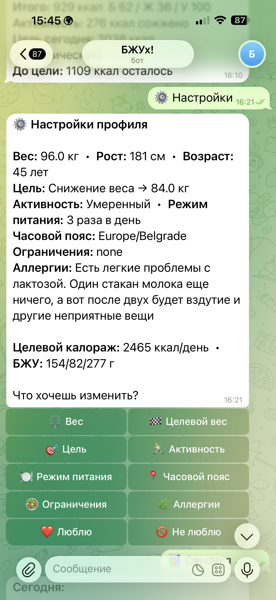
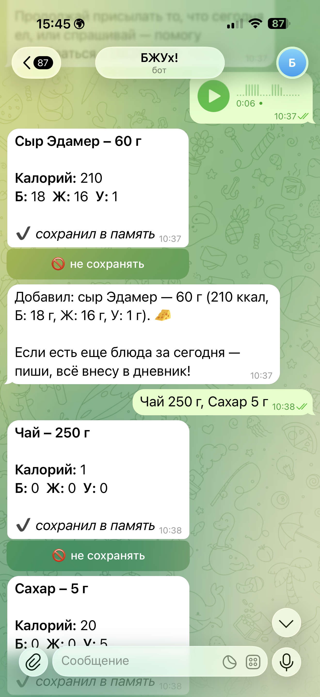
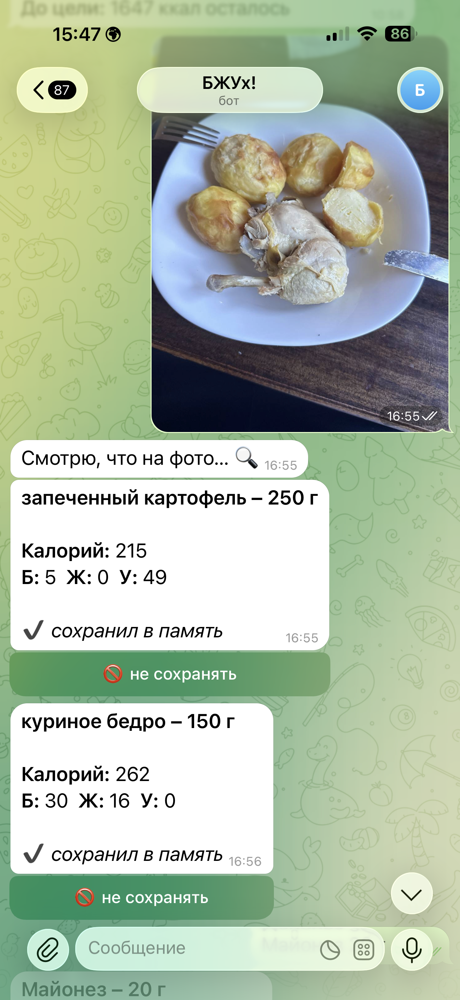
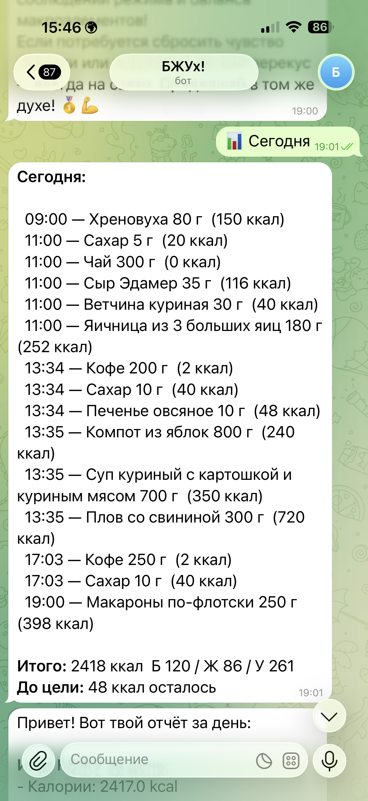

# Nutritionist Bot

AI-нутри-помощник в Telegram.

## Коротко

Nutritionist Bot — Telegram-бот для отслеживания питания: онбординг, распознавание еды по фото, КБЖУ, дневник, чат-агент и вечерний дайджест. Это продуктовый AI-кейс: не один промпт, а многошаговый пользовательский workflow.

## Демо

  
  

  
  

## Проблема

Люди часто бросают дневники питания, потому что ввод еды занимает слишком много усилий. Нужно снизить трение:

- сфотографировать еду;
- написать "съел творог 200 г";
- отправить голосовое;
- получить КБЖУ и понятный комментарий;
- вечером увидеть сводку дня.

При этом бот не должен выглядеть как медицинская консультация и должен явно ограничивать свою роль.

## Решение

Бот строится вокруг нескольких сценариев:

- обязательный дисклеймер и онбординг;
- расчёт целевых КБЖУ;
- логирование еды через фото, текст и голос;
- chat agent, который сам определяет намерение пользователя;
- дневной просмотр и удаление записей;
- вечерний digest.

Состояния пользователя и черновиков хранятся в базе, чтобы workflow переживал рестарты.

## Роль AI / Prompt Engineering

- Vision-модель распознаёт еду по фото.
- LLM-парсер превращает текст/голос в структурированные данные.
- Chat agent получает профиль, сегодняшний дневник и историю сообщений как контекст.
- Tool calling используется для логирования еды, а не только для свободного ответа.
- Промпты ограничены дисклеймером: бот не заменяет врача и не даёт медицинских назначений.

## Стек

- Python 3.12
- aiogram 3
- OpenAI SDK
- Supabase Postgres / asyncpg
- APScheduler
- pydantic / pydantic-settings
- systemd deploy
- AI-assisted development через Codex / Claude Code

## Что сделал лично я

- Спроектировал продуктовый workflow бота: onboarding, логирование, чат, digest.
- Перенёс идею из N8N-референса в кодовую архитектуру.
- Сформулировал требования к промптам, ограничениям и состояниям.
- С помощью AI-coding assistants собрал прототип и довёл этапы до production-ready состояния.
- Проверял UX и фиксировал решения в паспорте проекта.

## Результат

Бот доведён до продакшн-статуса для публичного запуска: есть онбординг, основные сценарии, чат-агент, дневник и digest.

## Ограничения и безопасность

- Нельзя публиковать реальные данные питания, профили, фото, ключи и БД.
- Публичная версия использует synthetic tests и не содержит health data.
- Health disclaimer сохранён в публичной документации.
- Clean repo исключает `keys.md`, `.env`, пользовательские данные, фото, N8N reference files и runtime-файлы.

## Что улучшил бы дальше

- Добавить Redis-backed throttling.
- Добавить per-user digest time.
- Добавить тесты для основных handlers.
- Подготовить демо-скриншоты с синтетическими данными.

## Ссылки

- Код: [portfolio-nutritionist](https://github.com/JohnGreen1981/portfolio-nutritionist)
